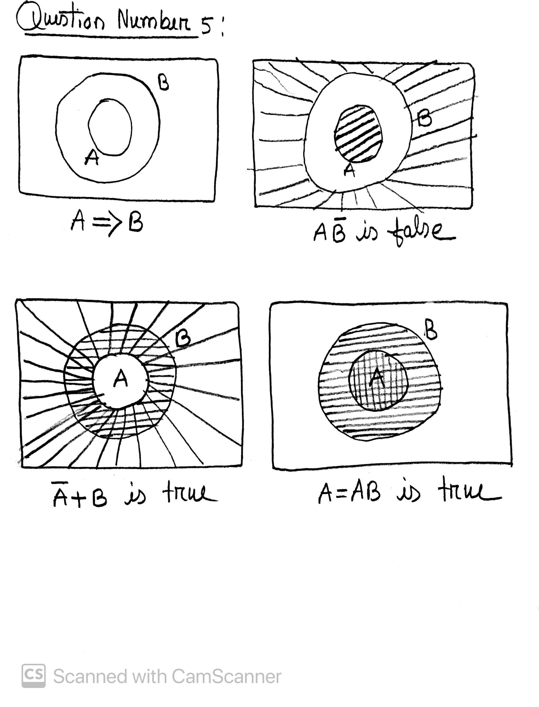
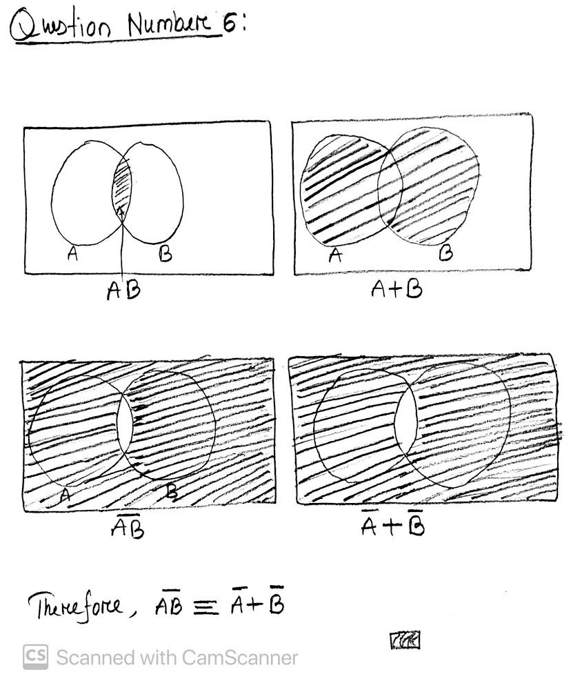

## Problem Part 2.A

```bash
Home@DESKTOP-FFMCP9F MINGW64 ~/Desktop/Git/DSP2020F/IDSF2020 (master)
$ git branch
* master
  test1
  test2

```

## Problem Part 2.B

```bash
Home@DESKTOP-FFMCP9F MINGW64 ~/Desktop/Git/DSP2020F/IDSF2020/hw/VCS (test1)
$ ls
README.md  test.txt


```

## Problem Part 2.C

```bash
Home@DESKTOP-FFMCP9F MINGW64 ~/Desktop/Git/DSP2020F/IDSF2020/hw/VCS (test1)
$ notepad test.txt


```

## Problem Part 2.D

```bash
Home@DESKTOP-FFMCP9F MINGW64 ~/Desktop/Git/DSP2020F/IDSF2020/hw/VCS (test1)
$ git add test.txt

Home@DESKTOP-FFMCP9F MINGW64 ~/Desktop/Git/DSP2020F/IDSF2020/hw/VCS (test1)
$ git commit -m 'test file committed' ./test.txt
[test1 c80f250] test file committed
 1 file changed, 1 insertion(+)
 create mode 100644 hw/VCS/test.txt

```

## Problem Part 2.E

```bash
Home@DESKTOP-FFMCP9F MINGW64 ~/Desktop/Git/DSP2020F/IDSF2020/hw/VCS (test2)
$ ls
README.md

#### I do not see the file test.txt in the branch of test2 because the changes stages on test1 branches
#### It never affect the other branches unless we merge one branch to another.

```

## Problem Part 2.F

```bash
Home@DESKTOP-FFMCP9F MINGW64 ~/Desktop/Git/DSP2020F/IDSF2020/hw/VCS (test2)
$ ls
README.md  test.txt

Home@DESKTOP-FFMCP9F MINGW64 ~/Desktop/Git/DSP2020F/IDSF2020/hw/VCS (test2)
$ notepad test.txt

```

## Problem Part 2.G

```bash
Home@DESKTOP-FFMCP9F MINGW64 ~/Desktop/Git/DSP2020F/IDSF2020/hw/VCS (test2)
$ git checkout test1
error: The following untracked working tree files would be overwritten by checkout:
        hw/VCS/test.txt
Please move or remove them before you switch branches.
Aborting
Home@DESKTOP-FFMCP9F MINGW64 ~/Desktop/Git/DSP2020F/IDSF2020/hw/VCS (test2)
$ git add test.txt

Home@DESKTOP-FFMCP9F MINGW64 ~/Desktop/Git/DSP2020F/IDSF2020/hw/VCS (test2)
$ git commit -m 'add test.txt on test2 branch' ./test.txt
[test2 4f7a7a2] add test.txt on test2 branch
 1 file changed, 2 insertions(+)
 create mode 100644 hw/VCS/test.txt
Home@DESKTOP-FFMCP9F MINGW64 ~/Desktop/Git/DSP2020F/IDSF2020/hw/VCS (test2)
$ git checkout test1
Switched to branch 'test1'
D       hw/README.md


```

## Problem Part 2.H

```bash
Home@DESKTOP-FFMCP9F MINGW64 ~/Desktop/Git/DSP2020F/IDSF2020 (master)
$ git merge test1
Updating 020905c..c80f250
Fast-forward
 hw/VCS/test.txt | 1 +
 1 file changed, 1 insertion(+)
 create mode 100644 hw/VCS/test.txt


```

## Problem Part 2.I

```bash
Home@DESKTOP-FFMCP9F MINGW64 ~/Desktop/Git/DSP2020F/IDSF2020/hw/VCS (master)
$ ls
README.md  test.txt

```

## Problem Part 2.J

```bash
Home@DESKTOP-FFMCP9F MINGW64 ~/Desktop/Git/DSP2020F/IDSF2020/hw/VCS (master)
$ git merge test2
CONFLICT (add/add): Merge conflict in hw/VCS/test.txt
Auto-merging hw/VCS/test.txt
Automatic merge failed; fix conflicts and then commit the result.

#### This conflict happnes because the file test.txt already exist in the master branch
#### To solve this problem we have to change the file in the test2 branch, then stage and commit can
#### solve the problem.


```

## Problem Part 2.K

```bash
Home@DESKTOP-FFMCP9F MINGW64 ~/Desktop/Git/DSP2020F/IDSF2020/hw/VCS (master|MERGING)
$ git checkout test2
error: you need to resolve your current index first
hw/VCS/test.txt: needs merge


```

## Problem Part 2.L

```bash
Home@DESKTOP-FFMCP9F MINGW64 ~/Desktop/Git/DSP2020F/IDSF2020/hw/VCS (master|MERGING)
$ git status
On branch master
Your branch is ahead of 'origin/master' by 1 commit.
  (use "git push" to publish your local commits)

You have unmerged paths.
  (fix conflicts and run "git commit")
  (use "git merge --abort" to abort the merge)

Unmerged paths:
  (use "git add <file>..." to mark resolution)
        both added:      test.txt

Changes not staged for commit:
  (use "git add/rm <file>..." to update what will be committed)
  (use "git restore <file>..." to discard changes in working directory)
        deleted:    ../README.md

Untracked files:
  (use "git add <file>..." to include in what will be committed)
        README.md

no changes added to commit (use "git add" and/or "git commit -a")

#### It seems there is some conflict needs to be fix and has to update them and commit them and some change has not been stages and committted

```

## Problem Part 2.M

```bash
Home@DESKTOP-FFMCP9F MINGW64 ~/Desktop/Git/DSP2020F/IDSF2020/hw/VCS (master|MERGING)
$ vim test.txt


```

## Problem Part 2.N

```bash
Home@DESKTOP-FFMCP9F MINGW64 ~/Desktop/Git/DSP2020F/IDSF2020/hw/VCS (master)
$ git checkout test2
Switched to branch 'test2'

```

## Problem Part 2.O

```bash
Home@DESKTOP-FFMCP9F MINGW64 ~/Desktop/Git/DSP2020F/IDSF2020/hw/VCS (test2)
$ git branch -d test1
error: The branch 'test1' is not fully merged.
If you are sure you want to delete it, run 'git branch -D test1'.


```

## Problem Part 2.P

```bash
Home@DESKTOP-FFMCP9F MINGW64 ~/Desktop/Git/DSP2020F/IDSF2020/hw/VCS (test2)
$ git checkout master
Switched to branch 'master'
Your branch is ahead of 'origin/master' by 3 commits.
  (use "git push" to publish your local commits)

Home@DESKTOP-FFMCP9F MINGW64 ~/Desktop/Git/DSP2020F/IDSF2020/hw/VCS (master)
$ git branch -d test1
Deleted branch test1 (was c80f250).

Home@DESKTOP-FFMCP9F MINGW64 ~/Desktop/Git/DSP2020F/IDSF2020/hw/VCS (master)
$ git branch
* master
  test2

```

## Problem Part 2.Q

```bash
#### The different message because when you try to delete test1 inside the test2 you can not be able to do it because
#### test1 and test2 created from master branch so if you want to delete test1 and test2 you have to go to master branch first


```

## Problem Part 2.R

```bash
Home@DESKTOP-FFMCP9F MINGW64 ~/Desktop/Git/DSP2020F/IDSF2020/hw/VCS (test2)
$ git branch -d test2
error: Cannot delete branch 'test2' checked out at 'C:/Users/Home/Desktop/Git/DSP2020F/IDSF2020'


```

## Problem Part 2.S

```bash
Home@DESKTOP-FFMCP9F MINGW64 ~/Desktop/Git/DSP2020F/IDSF2020/hw/VCS (master)
$ git branch -d test2
Deleted branch test2 (was 4f7a7a2).
Home@DESKTOP-FFMCP9F MINGW64 ~/Desktop/Git/DSP2020F/IDSF2020/hw/VCS (master)
$ git branch
* master

```

## Problem Part 2.T

```bash
Home@DESKTOP-FFMCP9F MINGW64 ~/Desktop/Git/DSP2020F/IDSF2020/hw/VCS (master)
$ git add --all

Home@DESKTOP-FFMCP9F MINGW64 ~/Desktop/Git/DSP2020F/IDSF2020/hw/VCS (master)
$ git commit -m 'Finish the project and about to push it'
[master a882002] Finish the project and about to push it
 1 file changed, 266 insertions(+)
 create mode 100644 hw/VCS/README.md
Home@DESKTOP-FFMCP9F MINGW64 ~/Desktop/Git/DSP2020F/IDSF2020/hw/VCS (master)
$ git push --all
Enumerating objects: 22, done.
Counting objects: 100% (22/22), done.
Delta compression using up to 4 threads
Compressing objects: 100% (14/14), done.
Writing objects: 100% (20/20), 3.01 KiB | 280.00 KiB/s, done.
Total 20 (delta 5), reused 0 (delta 0), pack-reused 0
remote: Resolving deltas: 100% (5/5), completed with 1 local object.
To https://github.com/rakib2132/IDSF2020.git
   020905c..a882002  master -> master


```

## HomeWork number 2

## Question one

The three pillars of science: Experiment, Theory, Computation+Data

## Question two

Three different applications of Computational and Data Sciences

1. a workflow bridging data, hypothesis/theory, and prediction (predictive computing).
2. a substitute for experiment and observational data, where it is not available (numerical simulation).
3. a substitute for theory, where it is not available (data-driven discovery via machine learning, deep learning, …).

## Question Three

The two types of reasoning in Science: Deductive and plausible reasoning

Example of Deductive Reasoning:  
first premise: Noble gases are stable.  
second premise: Neon is a noble gas.  
inference: Therefore, neon is stable.

Example of Plausible Reasoning:

A: It will start to rain by 10 am at the latest.  
B: The sky will become cloudy before 10 am.

if A is true then B is true
B is true
therefore, A become more plausible.

## Question Four

Lets summurize the series of argument first:

So, the first things is the policeman is plausible reasoning becasue as soon policeman heard
burglar alarm that raise the posibility in his mind that there is something suspicious.

1. if A = The burglar alarm
   then B = there is a posibility that burglary has happened.
2. if A = burglar alarm set up and you see a gentlemen is coming through the broken window
   then B = it raises another level of plausiblity that burglar has happened.
3. if A = There is a bag with a gentlemen that has lots of expensive jewelry
   then B = it raises another level of plausibility that burglar has happened.

Therefore, by combined all these argument we can say that it is highly plausible that
this gentlemen is a burglar.

## Question Five

[](question5.jpg)

## Question Six

[](question6.JPG)
