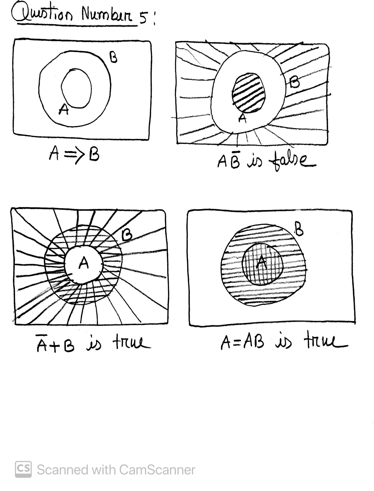
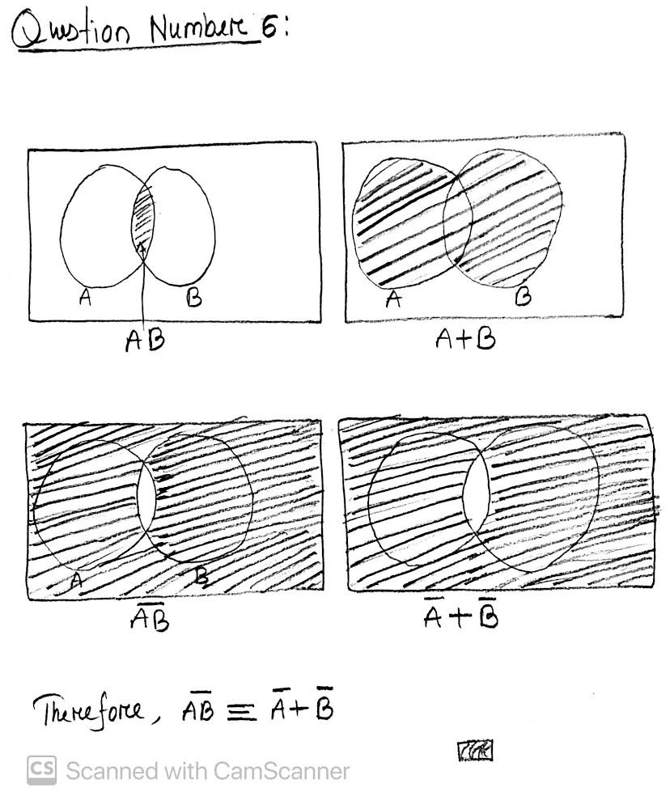

## HomeWork number 2

## Question one

```bash
The three pillars of science: Experiment, Theory, Computation+Data
```

## Question two

```bash
Three different applications of Computational and Data Sciences

1. a workflow bridging data, hypothesis/theory, and prediction (predictive computing).
2. a substitute for experiment and observational data, where it is not available (numerical simulation).
3. a substitute for theory, where it is not available (data-driven discovery via machine learning, deep learning, …).
```

## Question Three

```bash
The two types of reasoning in Science: Deductive and plausible reasoning

Example of Deductive Reasoning:
first premise: Noble gases are stable.
second premise: Neon is a noble gas.
inference: Therefore, neon is stable.

Example of Plausible Reasoning:

A: It will start to rain by 10 am at the latest.
B: The sky will become cloudy before 10 am.

if A is true then B is true
B is true
therefore, A become more plausible.
```

## Question Four

```bash
Lets summurize the series of argument first:

So, the first things is the policeman is plausible reasoning becasue as soon policeman heard
burglar alarm that raise the posibility in his mind that there is something suspicious.

1. if A = The burglar alarm
   then B = there is a posibility that burglary has happened.
2. if A = burglar alarm set up and you see a gentlemen is coming through the broken window
   then B = it raises another level of plausiblity that burglar has happened.
3. if A = There is a bag with a gentlemen that has lots of expensive jewelry
   then B = it raises another level of plausibility that burglar has happened.

Therefore, by combined all these argument we can say that it is highly plausible that
this gentlemen is a burglar.
```

## Question Five

[](question5.jpg)

## Question Six

[](question6.JPG)
