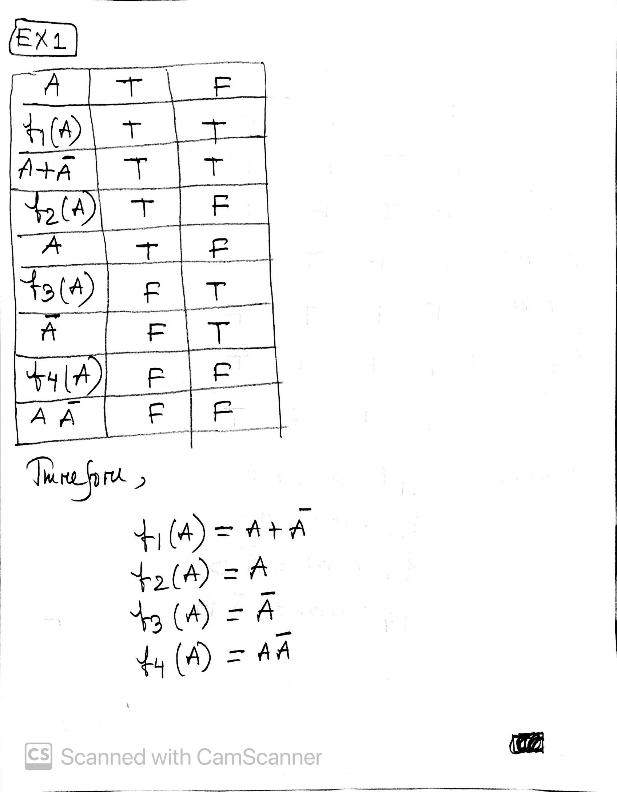

## HomeWork number 3

## Question one

## Question two

## Question Three

## Question Four

## Question Five

## Question Six

## Question Seven

The Three fundamental desiderata of probability There are

1. Degrees of plausibility are presented by real numbers.
2. Qualitative correspondence with common sense.
3. Consistency.

## Question Eight

The four major schools of probability theory are

1. Classical
2. Empirical
3. Subjective
4. Axiomatic
