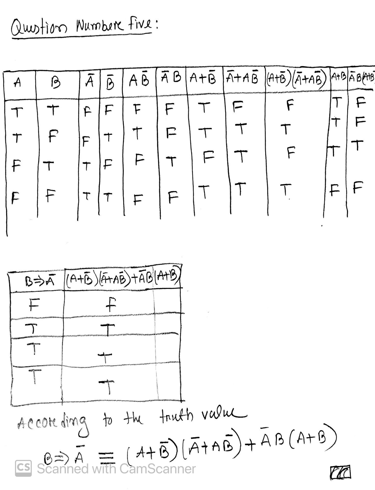

## Quiz number 2

## Question 1

Answer: Experiment, Theory, computation+Data

## Question 2

Answer: Predictive modeling, numerical simulation, data-driven modeling.

## Question 3

Answer: HomeWork Question number 3

## Question 4

Answer: HomeWork Question number 5

## Question 5

## Question 6

I learn from Professor Winguth’s presentation how weather forecast works, how we get the data  
 from different weather national center and also from the satellite. I have learn GEOS integrated observing system  
 Also I have learned how we use those equation to predict the weather such as conservation of mass,  
 conservation of Energy, Conservation of Momemtum and Conservation of Angular momemtum. These are called  
 primitive equation. Also how we can use AI to find optimal paremilizers. Also, He talked that  
 there is two main weather center where we collect data for instance, ECMWF and NCAR  
 Also, He talked about resolution and 26 layer and the box model. His lecture was very informative.  
 I have learned a lot from that lecture.
