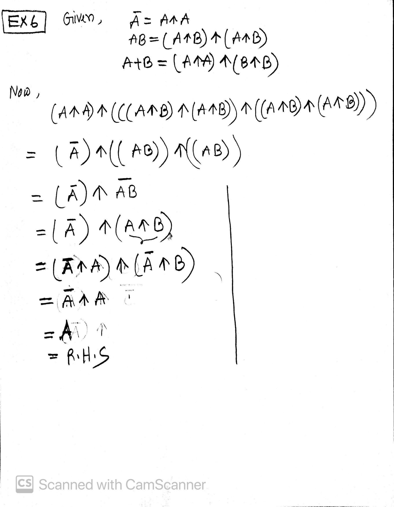

## Quiz number 3

## Question 1

```bash
The four major schools of probability theory are

1. Classical
2. Empirical
3. Subjective
4. Axiomatic
```

## Question 2

Classical Probability

## Question 3

Classical Probability

## Question 4

Classical Probability

## Question 5

Frequentist: Venn  
Bayesian:Keynes

## Question 6

[](img03.jpg)

## Question 7

```bash
The answer is homeowork 3 problem number 5
```
